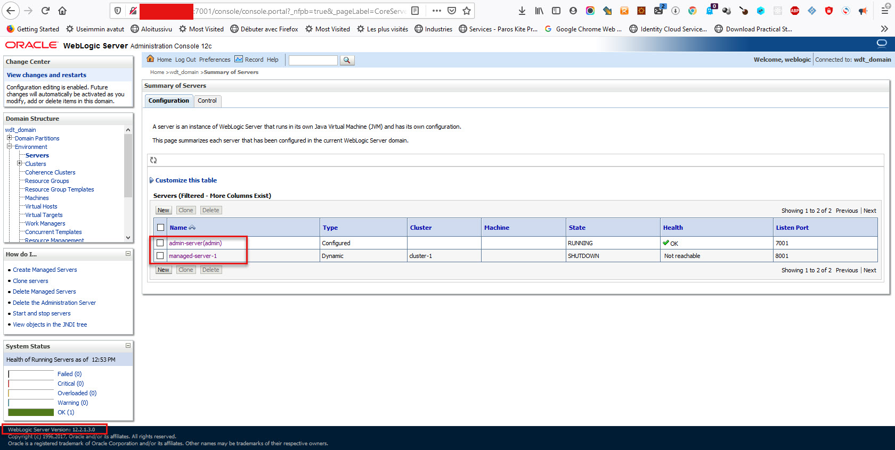

# WLS\_deploy\_scripts for the WLS Workshop migration toolkit Part1

The following scripts are using the [WDT Weblogic toolkit](https://github.com/oracle/weblogic-deploy-tooling/blob/master/samples/docker-domain/README.md)

The workshop is based on a simple scenario:

Two docker images will simulate two weblogic servers.

> ```
> CONTAINER IDIMAGE   COMMAND   CREATED STATUS  PORTS NAMES
> b2125ec2c26512214-domain:latest "/usr/sbin/sshd -D"   45 minutes ago  Up 45 minutes   0.0.0.0:9030->22/tcp, 0.0.0.0:9001->7001/tcp, 0.0.0.0:10001->8001/tcp, 0.0.0.0:9029->9001/tcp, 0.0.0.0:9028->10001/tcp, 0.0.0.0:9027->11001/tcp   test_sshd_target
> 
> da3bd4d58d2312213-domain-home-in-image-wdt:latest   "/usr/sbin/sshd -D"   2 hours ago Up 2 hours  0.0.0.0:7001->7001/tcp, 0.0.0.0:8001->8001/tcp, 0.0.0.0:9025->22/tcp, 0.0.0.0:9024->8453/tcp                                                      test_sshd
> ```
>
> 
>

The source server deploys a simple 12.12213 clustered weblogic domain



=======


We will use the WDT tool to create an image of the wls configuration, then we will transfer this image to the target wls server.

The target server is installed with 12214 version of WLS, but there isn't any domain configured

The WDT toolkit is already installed on both servers

Once the artifacts generated by the discovery on the first server will be copied to the target, we will run the domain creation utility from the WDT to generate a new domain  to our target WLS docker server.

The script ***lab-comands.txt*** https://github.com/eugsim1/WLS_deploy_scripts/blob/main/lab-commands.txt 

[]: 


